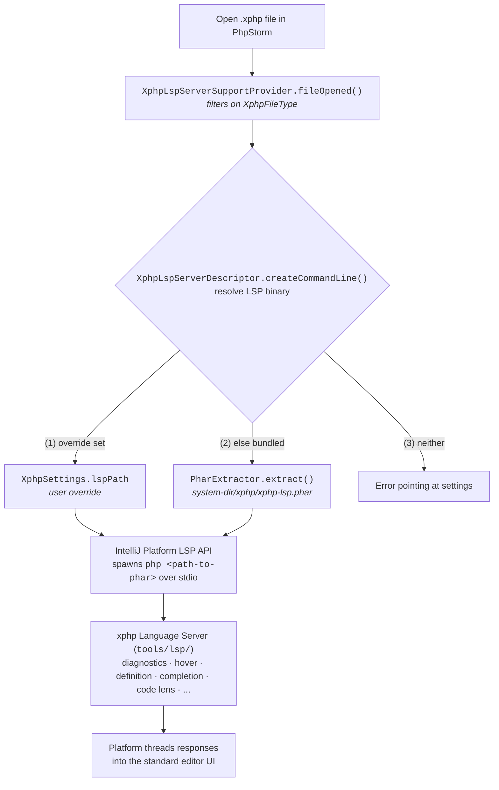

# xphp PhpStorm plugin

Editing intelligence for `.xphp` files inside PhpStorm -- every
capability of the [xphp Language Server](../lsp/) plus a few
PhpStorm-native niceties layered on top. One LSP server, two editor
integrations (this plugin and the [VS Code
extension](../vscode-extension/)).

For what's planned next, see [roadmap](./docs/roadmap.md).

## Install

The plugin isn't on the JetBrains Marketplace yet. Install fromdisk

```bash
make build # -> build/distributions/xphp-phpstorm-plugin-0.1.0.zip
```

In PhpStorm: **Preferences -> Plugins -> ⚙ -> Install Plugin from
Disk…** and pick the generated zip. Restart the IDE when prompted.

The LSP PHAR is bundled inside the plugin and extracted to PhpStorm's
system directory on first plugin load -- no separate server install
needed.

To override (e.g. point at a working tree's `bin/xphp-lsp` for plugin dev),
use **Preferences -> Tools -> xPHP -> "xphp LSP binary"**.

### Features

In addition to all features supported by the LSP, this plugin provides the
following:

- **Code lens click target** is dispatched client-side
  (the server's namespaced `xphp.showReferences` command), so clicking
  the lens lands in PhpStorm's native usage popup, not a generic LSP
  location list.
- **File rename sync** (the inverse of the LSP `willRenameFiles`
  direction) is implemented in plugin Kotlin: a Shift+F6 class
  rename triggers the matching file rename via PhpStorm's own
  refactoring pipeline.
- **Zero-config server install** -- the PHAR is bundled in the
  plugin jar; first plugin load extracts it to PhpStorm's system
  directory.

## Requirements

- **PhpStorm 2026.1 or later** (`since-build = 261`). The IntelliJ
  Platform LSP API went free across all editions in 2025.2 and
  rounded out its feature set in 2026.1 (code lens, range
  formatting, Optimize Imports). Older baselines would mean
  shipping through LSP4IJ as a compatibility shim -- significantly
  more code for an MVP than the two-versions-behind userbase saves.
- **JDK 21** for building the plugin. The Gradle wrapper picks up
  your toolchain automatically.

## Build

```bash
make build    # compiles Kotlin, runs unit tests, packages plugin jar
make test     # unit tests only (JUnit 5)
make verify   # IntelliJ Plugin Verifier compatibility check
make clean
```

The wrapper resolves to Gradle 9.0.0 (SHA-256 of the distribution
pinned in `gradle/wrapper/gradle-wrapper.properties`). First
invocation downloads Gradle and the PhpStorm 2026.1.2 distribution
into your user-level Gradle cache; subsequent runs reuse them.

## How it's wired



Plugin-only Kotlin classes that wrap or extend the standard LSP path:

- `XphpFileRenameListener` -- listens for VFS file moves /   renames and
  dispatches LSP 3.17 `willRenameFiles` requests (the IntelliJ LSP API doesn't
  fire them natively).
- `XphpClassRenameListener` (via `BulkFileListener`) -- listens for class
  renames inside `.xphp` files and triggers the matching file rename to keep
  `PSR-4` in sync.
- `XphpShowReferencesCommandsSupport` -- intercepts the server's
  `xphp.showReferences` code-lens command and opens PhpStorm's
  native usage popup at the lens position.
- `PharExtractor` -- copies the bundled PHAR from the plugin jar
  to PhpStorm's system directory on first load.
